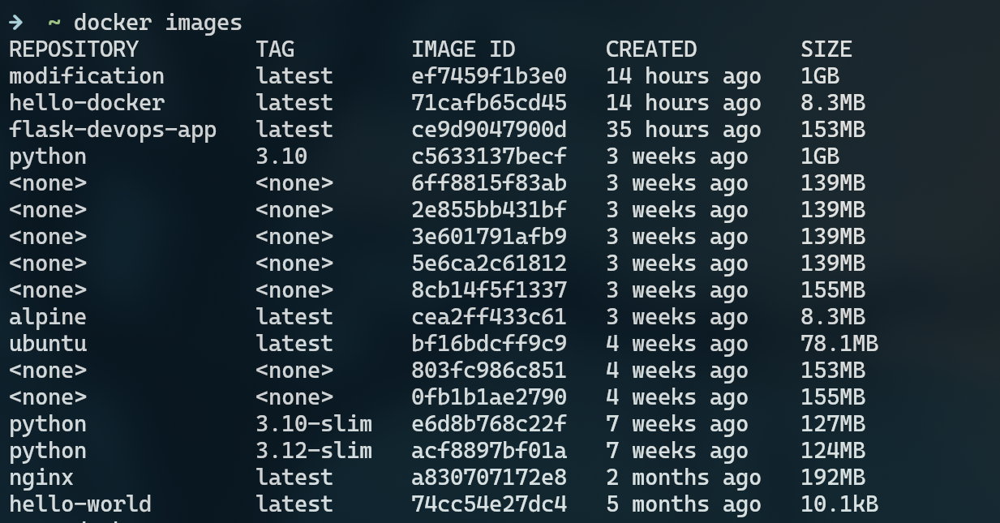
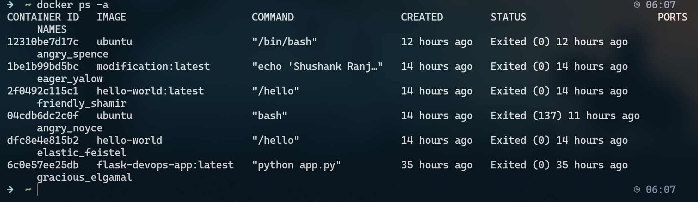

**Logic-Building Question:**

Q1. What's the difference between `docker run -it ubuntu` and `docker run ubuntu`?
->  ✅ Difference:
        
  docker run ubuntu
⟶ Runs Ubuntu non-interactively (default is background mode).
  It starts, runs the default command (/bin/bash), sees no input, and exits immediately.

  docker run -it ubuntu
⟶ Runs Ubuntu interactively with a terminal attached.

-i: keeps STDIN open

-t: allocates a pseudo-TTY (a terminal)

⟶ You get a shell prompt inside the container (like you're using Ubuntu directly):
  root@container-id:/#

Q2. What’s happening behind the scenes when you run a container?
->  When you run a container, Docker takes an existing image, creates a lightweight isolated environment    ,allocates resources, and then executes the app or command inside that environment.

Q3. Why is Docker better than running software directly on your OS?
->  Docker avoids dependency conflicts, keeps apps isolated, uses less system resources, and makes it       easy to share and deploy apps by packaging everything into a single portable image.

--------------------------------------------------------------------------------------------------------
**Deliverables:**

1. Screenshot or output of `docker images` and `docker ps -a`
-> 
   

